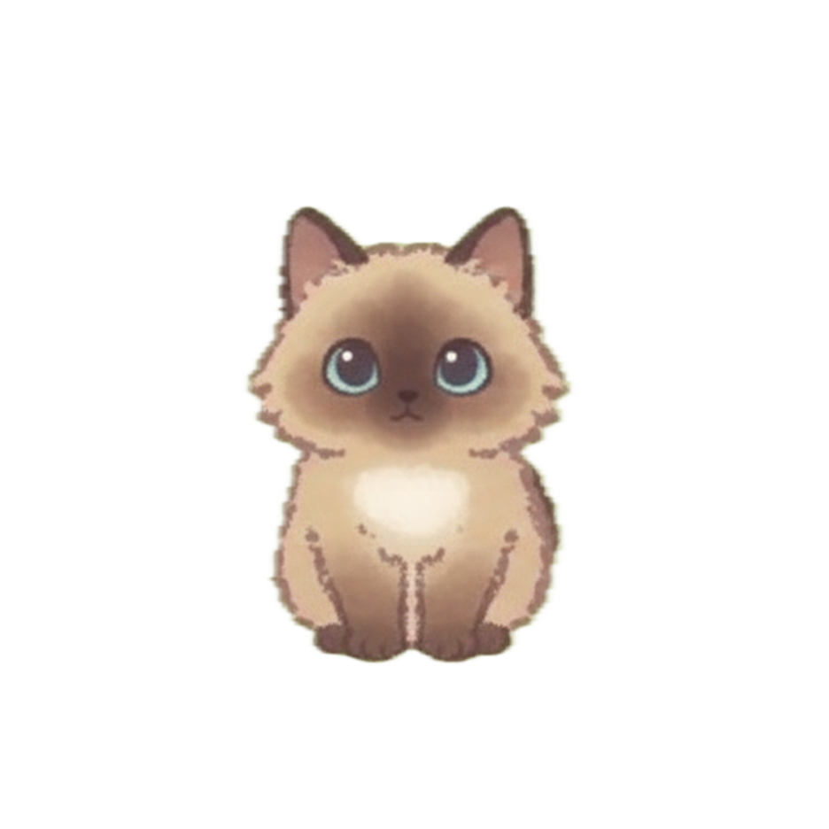

Desktop Pet: Cat Companion 🐾

A cute desktop pet that keeps you company while you code! This little cat will sit by your side as you work on your projects.
Features
Adorable animated cat companion
Lightweight and non-intrusive
Easy to set up and use
Brings joy to your coding sessions
Installation
Download in Release by your plantform

[Release link](https://github.com/johnwayne1995/GodotCatGame/releases/tag/Release_Game)

Usage
Once launched, your cat companion will appear on your desktop. You can:
You can click on the yarn ball with your mouse to make it bounce so the cat can chase it
you can pet its head
and you can zoom in and out
